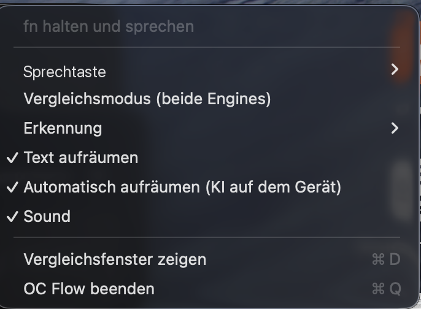

# O.C. Flow installieren

Fünf Minuten, einmalig. Danach: Taste halten, sprechen, loslassen — der Text landet da, wo dein Cursor steht.

**Voraussetzung:** macOS 26 oder neuer. Prüfen unter  ▸ Über diesen Mac. Steht da eine kleinere Zahl, zuerst macOS aktualisieren.

## Schritt 1: Terminal öffnen

Cmd + Leertaste drücken, „Terminal" tippen, Enter.

## Schritt 2: Apples Entwickler-Werkzeuge holen

Diesen Befehl einfügen und Enter drücken:

```bash
xcode-select --install
```

Es öffnet sich ein Fenster, dort auf „Installieren" klicken und warten, bis es fertig ist (ein paar Minuten). Kommt stattdessen eine Meldung wie „already installed", ist alles gut — weiter zu Schritt 3.

## Schritt 3: App herunterladen und bauen

Diese drei Befehle nacheinander einfügen, nach jedem Enter drücken:

```bash
git clone https://github.com/yassinebb2005-oss/OC-Flow.git
```

```bash
cd OC-Flow
```

```bash
make install
```

Der letzte Befehl arbeitet ein paar Minuten. Am Ende startet O.C. Flow von selbst und oben in der Menüleiste erscheint ein kleines O.C.

## Schritt 4: Zwei Berechtigungen erteilen

1. Es öffnet sich eine Abfrage für die **Bedienungshilfen** — falls nicht: Systemeinstellungen ▸ Datenschutz & Sicherheit ▸ Bedienungshilfen. Dort **OC Flow** einschalten. Steht der Schalter dort schon auf an, weil du O.C. Flow früher einmal installiert hattest, dann gilt er für die alte Fassung und wirkt nicht. In dem Fall den Eintrag mit dem Minus-Knopf entfernen und die App neu starten, dann kommt die Abfrage wieder.
2. Die App **einmal beenden und neu starten**: auf das O.C. in der Menüleiste klicken ▸ „OC Flow beenden", dann im Ordner Programme wieder öffnen.
3. Jetzt in irgendein Textfeld klicken, die **rechte ⌥-Taste** gedrückt halten und einen Satz sagen. Beim ersten Mal fragt macOS nach dem **Mikrofon** — erlauben, dann klappt es ab dem zweiten Versuch.

## Sprechtaste umstellen

Voreingestellt ist die rechte ⌥-Taste. Viele nehmen lieber **fn**. Umstellen: im O.C.-Flow-Fenster oben rechts auf das **Zahnrad**, dann unter **Sprechtaste** auf „fn" klicken. Es greift sofort, kein Neustart nötig. Der gleiche Schalter sitzt auch im Menüleisten-Menü unter „Push-to-talk key".

fn bleibt dabei normal benutzbar, also fn + Pfeiltasten, fn + Entf und der Emoji-Picker.

## Apple Intelligence einschalten

Damit die App den Text aufräumt, also Füllwörter rauswirft, Kommas setzt und Versprecher korrigiert, muss **Apple Intelligence** an sein. Klick auf das O.C. in der Menüleiste und schau auf die Zeile **Automatisch aufräumen (KI auf dem Gerät)**.

So soll es aussehen, beide Zeilen angehakt und normal lesbar:



Ist die Zeile stattdessen grau und darunter steht „Apple Intelligence ist in den Systemeinstellungen ausgeschaltet", dann Systemeinstellungen ▸ Apple Intelligence & Siri einschalten und zurück im Menü **Automatisch aufräumen** anhaken.

Alles rechnet auf deinem Mac, nichts geht ins Internet.

**Wenn der Text lange braucht, lass das Aufräumen aus.** Das Modell belegt rund 3 GB Arbeitsspeicher. Ist der knapp, schiebt macOS es ständig raus und lädt es wieder, und dann wartest du pro Satz mehrere Sekunden. Auf einem Mac mit 8 GB ist das gemessen der Normalfall: mit Aufräumen 11 bis 23 Sekunden pro Satz, ohne Aufräumen 0,2 Sekunden. Auf einem Mac mit 16 GB haben wir es ausprobiert, dort kommt der Text ohne merkliche Wartezeit.

Deshalb der Test, der zählt: diktiere einen Satz und schau auf die Uhr. Ist der Text nach einer guten Sekunde da, lass **Automatisch aufräumen** an. Dauert es länger, hak es ab. Du verlierst dabei nur das Feinschliff-Aufräumen, Satzzeichen und die Wörterbuch-Korrekturen macht die App weiterhin. Wie viel Speicher dein Mac hat, steht unter Apfelmenü ▸ Über diesen Mac.

## Neue Version holen

Es gibt keine automatische Aktualisierung. Wenn Yassine sagt, es gibt was Neues, im Terminal:

```bash
cd ~/OC-Flow && git pull && make install
```

Das holt den neuen Code, baut ihn und startet die App neu. Dauert ein bis zwei Minuten.

**Danach einmal die Sprechtaste freigeben.** Nach jedem Update erkennt macOS die App als neu und die alte Freigabe gilt nicht mehr. Merkst du daran, dass beim Halten der Sprechtaste nichts passiert, obwohl der Schalter in den Systemeinstellungen weiter auf an steht. So setzt du es zurück:

```bash
tccutil reset Accessibility com.oc-hairsystems.ocflow
```

Dann Systemeinstellungen komplett beenden mit ⌘Q, die App beenden (O.C. in der Menüleiste ▸ „OC Flow beenden") und aus dem Ordner Programme neu öffnen. Die Abfrage für die Bedienungshilfen kommt wieder, dort erlauben. Danach läuft es.

**Das Freigeben ein für alle Mal loswerden:** einmal dieses Skript laufen lassen.

```bash
cd ~/OC-Flow && bash Tools/create-signing-cert.sh
```

Es erstellt ein eigenes Signierzertifikat auf deinem Mac, kostenlos. Danach bleibt die App für macOS bei jedem Update dieselbe, und die Freigabe hält. Beim nächsten `make install` fragt der Schlüsselbund einmal, ob codesign den Schlüssel benutzen darf, dort auf „Immer erlauben" klicken.

## Fertig

Ab jetzt überall: Sprechtaste halten, sprechen, loslassen.

**Hakt etwas?** In der [README](README.md) steht unter „Wenn etwas hakt", was zu tun ist — oder frag Yassine.
